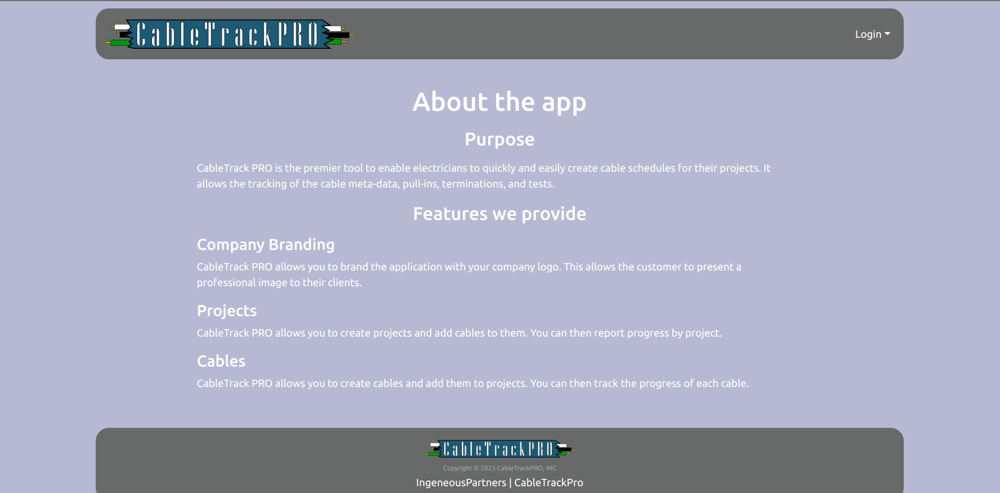
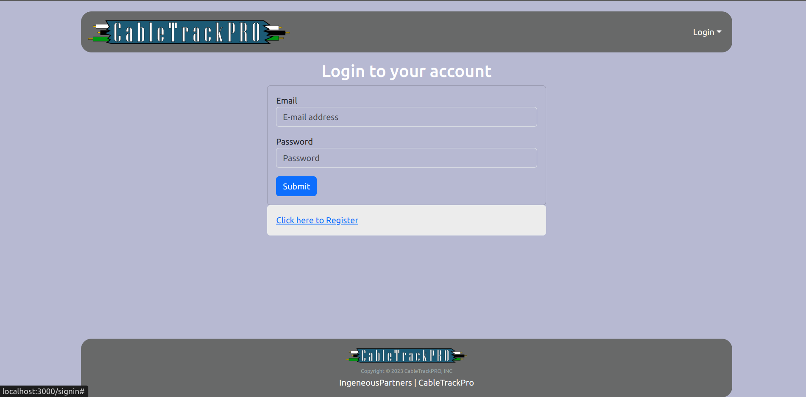
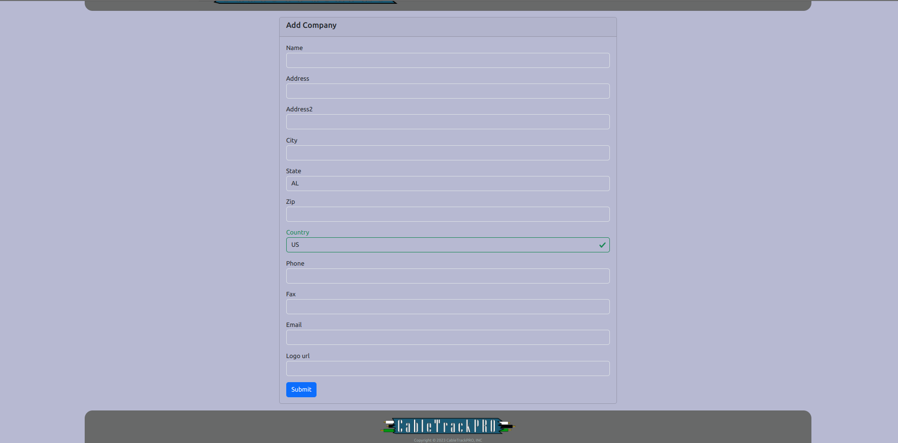
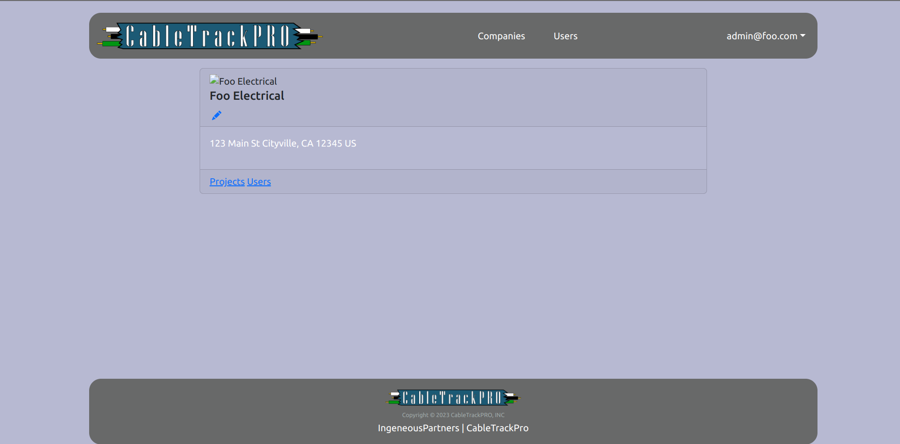
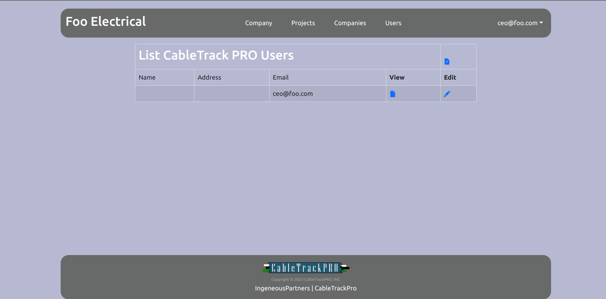
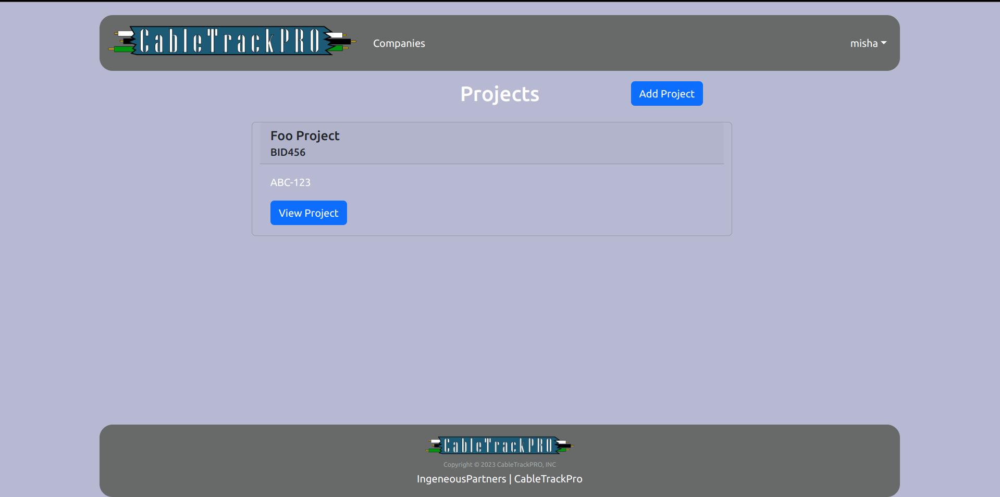
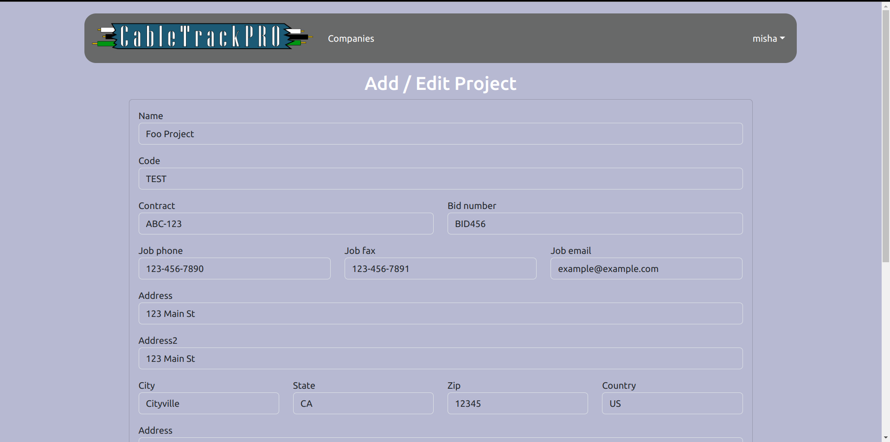

[ Ingenious Partners on GitHub](https://github.com/ingeniouspartners)

## Table of contents

* [Team](#team)
  * [Contract](#contract)
* [CableTrackPro](#cabletrackpro)
  * [Purpose](#purpose)
  * [Milestones](#milestones)
    * [M1](#m1)
    * [M2](#m2)
  * [Deployment](#deployment)
  * [Features](#features)
    * [Company Branding](#company-branding)
    * [Projects](#projects)
    * [Cables](#cables)
  * [Entity Diagram](#entity-diagram)
  * [User interface](#user-interface)
    * [Landing Page](#landing-page)
    * [Sign Up](#sign-up)
    * [Sign In](#sign-in)
    * [Sign Out](#sign-out)
    * [Edit Profile](#edit-profile)
    * [Add/Edit Company](#addedit-company)
    * [Add/Edit Project](#addedit-project)

[//]: # (    * [Add/Edit Cable]&#40;#addedit-cable&#41;)

[//]: # (* [User Guide]&#40;#user-guide&#41;)
[//]: # (* [Community Feedback]&#40;#community-feedback&#41;)
[//]: # (* [Developer Guide]&#40;#developer-guide&#41;)
[//]: # (* [Development History]&#40;#development-history&#41;)
[//]: # (* [Continuous Integration]&#40;#continuous-integration&#41;)
[//]: # (* [Walkthrough videos]&#40;#walkthrough-videos&#41;)
[//]: # (* [Example enhancements]&#40;#example-enhancements&#41;)

## Team

#### [Contract](https://docs.google.com/document/d/18tcC9dBUBwXgLGMExS6Sb9rpvzeySdBsoFDaM1eFMkc/edit?usp=sharing)

<h3 style="text-align:center;">Aaren Orquia</h3>

Through this project, I would like to gain more experience on team based projects.

All of the programming projects I've done so far have been solo projects, so I’m excited to see the process of creating a practical application as a team. I would like to improve my knowledge on meteor and react by learning through my group members or online.

My background is from prior ICS classes at UH Manoa. I’d say my greatest skill is that I can spend long periods of time on something until I finish. It’s not really a skill, but I will spend as many hours needed to complete a project.

<h3 style="text-align:center;">Andrea Jans</h3>

I would like to learn more about Meteor, React, Bootstrap, and SimpleSchema. I would like to practice my front-end development, especially CSS.

I've been programming for 40 years, am artistic, and can weld. I'm really good at laying out objects.

I work 40 hours a week, so I am free in the evenings and weekends. That is when I plan to work on the project.

<h3 style="text-align:center;">Matthew Yamamoto</h3>

I'd like to work on my communication, asking the right questions and being able to explain my own ideas clearly.

My background is basically 4 years of programming, but most of that experience doesn't apply here. What does apply though is that if I don't know something, I'm generally good at figuring it out. I'm also detail-oriented, so I can be a second pair of eyes if something's not working.

My time constraints are fairly lax, I can work in the morning 3 times a week, or in the afternoon, but for the best results, I'm free in the evenings and weekends, and I plan to work at those times.

<h3 style="text-align:center;">Mikhail Shkaralevich</h3>

I am excited to work on the project in the team based environment. I would love to develop efficient communication skills.

My background is mostly based on web development using Django framework and tools such as Figma for web-design. All of my previous projects were solo.

I am working 12-20 hours a week but the schedule is flexible. I try to adjust my schedule to the time that works for the most team members.

<h3 style="text-align:center;">Ursula Nichols</h3>

I am excited to work on this project to improve my collaboration skills; I have only had one computer science group project before this.

My background is based on classes from the UH Mānoa BS computer science program

I work 30-40 hours a week Tuesdays and Thursdays are ideal. I can take off mornings before class or afternoons on Monday/Wednesday/Friday to meet. If weekends are best, I can always take off work a little early and meet in the afternoon

## CableTrackPro

[Link to the project's repo](https://github.com/ingeniouspartners/cabletrack.pro)

## Purpose

CableTrack PRO is the premier tool to enable electricians to quickly and easily create cable schedules for their projects. It allows the tracking of the cable meta-data, pull-ins, terminations, and tests.

## Milestones

CableTrack PRO development is managed via Milestone projects and the issues they contain.

### [M1](https://github.com/orgs/ingeniouspartners/projects/1)

In Milestone 1, we concentrated on laying out foundational functionality, primarly the components that will be used to create the pages.

### [M2](https://github.com/orgs/ingeniouspartners/projects/2)

In Milestone 2, we will be putting together the pages utilizing the components created during M1. This should lead to a second round of page development were we refactor code for reusability.

## Deployment

[DigitalOcean](https://app.cabletrack.pro)

## Features

#### Company Branding

CableTrack PRO allows you to brand the application with your company logo. This allows the customer to present a professional image to their clients.

#### Projects

CableTrack PRO allows you to create projects and add cables to them. You can then report progress by project.

#### Cables

CableTrack PRO allows you to create cables and add them to projects. You can then track the progress of each cable.

## Entity Diagram

## User interface

### Landing Page

The welcome screen that allows the visitor to see what the application is about and give them the opportunity to sign-up or sign-in.

[//]: # (### Home Signed In)

[//]: # ()
[//]: # (The home page of a user. It provides information about user's profile, company and associated projects.)

[//]: # ()
[//]: # ()

### Sign Up

Ask the user for basic information, such as their email address (usernane) and desired password.

### Sign In

Ask the user for their email address (username) and password.

### Sign Out

Signs the user out of the application and redirects them to the Home page.

[//]: # (### Edit Profile)

[//]: # ()
[//]: # (Allows the user to update their profile information, such as First and Last Name, Photo URL.)

[//]: # ()
[//]: # ()

### Add/Edit Company

Add or Edit the Company. This would include fields for Company Name, Logo URL, Address, City, State, ZIP, Country, and associated Users. If the Company ID is not provided, a new instance is created with a template model, otherwise the model is filled from the Company collection using <code>findOne()</code>.

### List Company

Lists companies associated with the user. It provides links to add or edit a company.

### View Company

View of a specific company with a detailed description about it.

### List users associated with a company

### List projects

A table of projects associated with a company

### Project view

The view of a project. It provides information about a project in a form of a table.

### Add/Edit Project

Add or Edit the Project. This would include fields for Project Code, Name, associated Users. If the Project ID is not provided, a new instance is created with a template model, otherwise the model is filled filled out from the Project collection using <code>findOne()</code>.

[//]: # (### Add/Edit Cable)

[//]: # ()
[//]: # (Add or Edit the Cable. This would include fields for Cable Code, Name, Type, Phase Code, etc. If the Cable ID is not provided, a new instance is created with a template model, otherwise the model is fille out from the Cable collection using <code>findOne&#40;&#41;</code>.)

[//]: # ()
[//]: # ()
